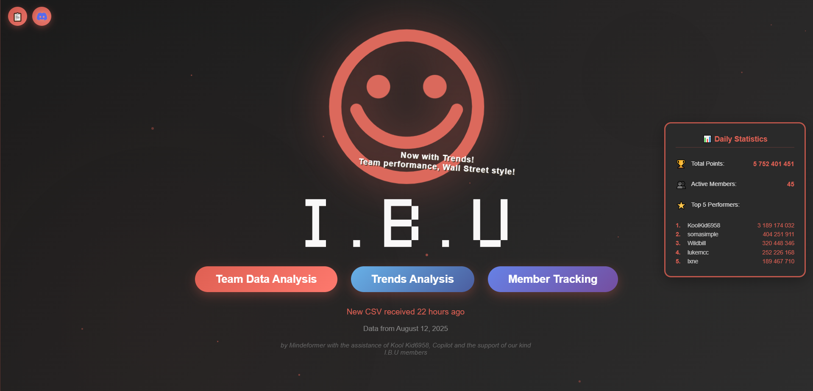

# 🐑 IBU Dashboard - SheepIt Render Farm Team Analytics

[](https://python.org)
[](https://flask.palletsprojects.com)

> **A modern, cinematic web dashboard for tracking SheepIt Render Farm team performance and statistics.**

## 🎯 What is IBU?

**IBU (Intelligent Beings United)** is a collaborative team on [SheepIt Render Farm](https://www.sheepit-renderfarm.com/) - a distributed computing project that helps Blender artists render their 3D animations and images by sharing computational resources across a global network of volunteers.

### 🌍 About SheepIt Render Farm
- **Community-driven**: Free render farm powered by volunteers
- **Blender-focused**: Specializes in rendering Blender projects
- **Point-based system**: Contributors earn points for computational work
- **Global network**: Thousands of users worldwide sharing resources

### 👥 About Team IBU
Our team brings together passionate 3D artists, developers, and rendering enthusiasts who contribute their computational power to help the Blender community create amazing content.

## 🚀 What This Dashboard Does

The IBU Dashboard is a comprehensive analytics platform that provides:

### 📊 **Real-Time Team Analytics**
- **Live Statistics Panel**: Current team points, active members, and top performers
- **Interactive Pie Charts**: Visual breakdown of individual member contributions
- **Performance Tracking**: Historical data analysis and trends
- **Google Drive Integration**: Automatic data synchronization and updates

### 🎨 **Modern User Experience**
- **Cinematic Landing Page**: Animated particles and smooth transitions
- **Interactive Visualizations**: Powered by Plotly for dynamic charts
- **Real-time Updates**: Live connection status and data refresh

### 🔧 **Technical Features**
- **Automated Data Collection**: Scrapes and processes team performance data
- **Cloud Integration**: Secure Google Drive API integration
- **Scalable Architecture**: Built with Flask for easy hosting and maintenance

## 🎭 Screenshots

### Landing Page

*Modern, animated landing page with live statistics panel*

### Team Analytics
*Interactive charts showing team member contributions and performance metrics*

## 🛠️ Technology Stack

- **Backend**: Python 3.8+, Flask 2.3+
- **Frontend**: HTML5, CSS3, JavaScript (ES6+)
- **Data Visualization**: Plotly.js
- **Data Processing**: Pandas, NumPy
- **Cloud Services**: Google Drive API
- **Deployment**: Render.com compatible
- **Styling**: Modern CSS with animations and responsive design

## 🚀 Quick Start

### Prerequisites
- Python 3.8 or higher
- Google Service Account with Drive API access
- SheepIt team data access

### Installation

1. **Clone the repository**
   ```bash
   git clone https://github.com/yourusername/ibu-dashboard.git
   cd ibu-dashboard
   ```

2. **Install dependencies**
   ```bash
   pip install -r requirements.txt
   ```

3. **Set up SheepIt credentials for data scraping**
   ```bash
   # Windows
   set SHEEPIT_USERNAME=your_username
   set SHEEPIT_PASSWORD=your_password
   
   # Linux/Mac
   export SHEEPIT_USERNAME=your_username
   export SHEEPIT_PASSWORD=your_password
   ```

4. **Run the scraper to get initial data**
   ```bash
   python sheepit_scraper.py
   ```

5. **Run the dashboard application**
   ```bash
   python IBU_dashboard.py
   ```

6. **Open your browser**
   Navigate to `http://localhost:5000`

## 🤖 SheepIt Data Scraper

The dashboard includes an integrated data scraper (`sheepit_scraper.py`) that fetches team data from SheepIt Renderfarm.

### Scraper Setup

#### Method 1: Environment Variables (Recommended)
```bash
# Windows
set SHEEPIT_USERNAME=your_username
set SHEEPIT_PASSWORD=your_password

# Linux/Mac
export SHEEPIT_USERNAME=your_username
export SHEEPIT_PASSWORD=your_password
```

#### Method 2: Direct Edit
Edit `sheepit_scraper.py` and replace the placeholder credentials:
```python
USERNAME = "your_username_here"
PASSWORD = "your_password_here"
```

### Running the Scraper

#### Manual Run
```bash
python sheepit_scraper.py
```

#### Automated Scheduling

**Windows Task Scheduler:**
1. Open Task Scheduler
2. Create Basic Task
3. Set trigger (e.g., daily at specific time)
4. Set action to run: `python path\to\sheepit_scraper.py`

**Linux/Mac Cron Job:**
```bash
# Edit crontab
crontab -e

# Add line for daily run at 9 AM
0 9 * * * cd /path/to/dashboard && python sheepit_scraper.py
```

### Scraper Output

The scraper will:
- Log into SheepIt Renderfarm
- Fetch team data from team page
- Save as `sheepit_team_points_YYYY-MM-DD.csv` in `Scraped_Team_Info/`
- Dashboard automatically detects new files within 30 seconds

### Troubleshooting

- **Login fails**: Verify username and password
- **No team data**: Ensure access to team 2109  
- **File save errors**: Check `Scraped_Team_Info/` folder permissions

##  Features & Goals

### ✅ **Current Features**
- Real-time team statistics display
- Interactive member contribution charts
- Local file-based data storage
- Integrated data scraper
- Responsive, modern UI
- Automatic file detection

### 🚧 **Planned Features**
- Historical performance trends
- Member ranking system
- Export capabilities for reports
- Email notifications for milestones
- Advanced filtering and search
- Mobile app companion

### 🎨 **Design Philosophy**
- **User-Centric**: Intuitive interface that makes data accessible
- **Performance-Focused**: Fast loading and smooth interactions
- **Secure by Default**: Best practices for credential management
- **Community-Driven**: Built by and for the SheepIt community

## 🤝 Contributing

We welcome contributions from the community! Whether you're a developer, designer, or SheepIt enthusiast:

### Ways to Contribute
- 🐛 **Bug Reports**: Found an issue? Let us know!
- 💡 **Feature Requests**: Have ideas for improvements?
- 🔧 **Code Contributions**: Submit pull requests
- 📖 **Documentation**: Help improve our guides
- 🎨 **Design**: UI/UX improvements and suggestions

### Development Setup
1. Fork the repository
2. Create a feature branch: `git checkout -b feature-name`
3. Make your changes and test thoroughly
4. Submit a pull request with a clear description

## 📊 SheepIt Integration

This dashboard specifically tracks:
- **Individual Points**: Each team member's contribution
- **Team Ranking**: Position relative to other SheepIt teams
- **Active Members**: Currently participating team members
- **Historical Data**: Performance trends over time
- **Milestone Tracking**: Team achievements and goals

## 🔒 Security & Privacy

- **No Personal Data**: Only public SheepIt statistics are collected
- **Secure Credentials**: Environment variable-based authentication
- **Open Source**: Transparent codebase for community review
- **GDPR Compliant**: Respects user privacy and data protection

## 📄 License

This project is licensed under the MIT License - see the [LICENSE](LICENSE) file for details.

## 🙏 Acknowledgments

- **SheepIt Render Farm**: For providing the amazing platform that makes this possible
- **Blender Community**: For creating and supporting open-source 3D creation
- **Team IBU Members**: For their continuous contributions and feedback
- **Open Source Community**: For the tools and libraries that power this dashboard

## 📬 Contact & Support

- **Team**: IBU (Intelligent Beings United)
- **Creator**: Mindeformer
- **Assistant**: GitHub Copilot
- **Community**: I.B.U members

### Links
- [SheepIt Render Farm](https://www.sheepit-renderfarm.com/)
- [Blender](https://www.blender.org/)
- [Team IBU Page](https://www.sheepit-renderfarm.com/team/[team-id])

---

<div align="center">

**Built with ❤️ by the IBU Team**

*Empowering the Blender community through collaborative rendering*

[](https://www.sheepit-renderfarm.com/)
[](https://www.blender.org/)

</div>
